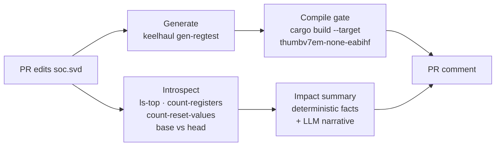

# Spec-Driven Register Verification Pipeline

A CI pipeline where a **change to the hardware spec drives the verification** —
no hand-written register tests. Edit a CMSIS-SVD memory-map file in a pull
request and the pipeline regenerates the register test suite from the new spec,
proves it compiles for the target MCU, and posts a human-readable impact summary
back on the PR.

The demo chip is the TI **TM4C123GH6PM** (ARM Cortex-M4F): **781 registers**,
**760** with a testable reset value — all derived from the spec, none typed by
hand.

## The problem

Memory-map specs change constantly: peripherals get added, register offsets
shift, reset values change. Every such change silently invalidates the
verification suite. Today someone finds out by hand — diffing XML, updating
tests, and triaging failures that might be spec bugs, implementation bugs, or
stale tests. This makes the spec change itself the trigger, so the suite is
never stale and the reviewer gets a plain-English summary of what moved.

## How it works



1. **Trigger** — a GitHub Actions workflow fires on PRs touching `svd/**`. The
   SVD path is a workflow variable; the pipeline is chip-agnostic.
2. **Introspect** — read-only tooling counts peripherals, registers, and
   testable reset values on both the base and head revision.
3. **Generate** — [`keelhaul`](https://github.com/soc-hub-fi/keelhaul)
   regenerates the whole register test suite (read + reset-value tests) from the
   head SVD.
4. **Compile gate** — the generated crate must build for the target triple
   (`thumbv7em-none-eabihf`). This *is* the pass criterion: the regenerated
   suite provably builds against the new spec.
5. **Impact summary** — the reviewer gets a two-layer summary:
   - **facts**, computed deterministically by diffing the introspection output
     (exact counts, added/removed peripherals, offset/reset-value edits);
   - **narrative**, an LLM's prose reading of the diff, added when a headless LLM
     CLI is available.
6. **Report** — one PR comment with the summary, the introspection table, and
   the compiled/dropped test counts. Re-running edits the same comment instead
   of stacking new ones.

### Design principle: deterministic tools do the volume, the LLM does judgment

An SVD pair is on the order of a million tokens; the LLM never sees it. It gets
the `git diff` plus a few KB of introspection output — same information, bounded
input — and only writes prose. Every exact number in the summary comes from the
deterministic layer, so the counts are correct with or without a model, and the
whole pipeline stays green even on PRs with no LLM credentials (fork PRs, for
instance) — the summary simply drops to the facts table.

## Design decisions

**GitHub Actions, not a hosted workflow engine.** The trigger (SVD changed in a
PR), the diff, and the reporting surface (PR comment) all live in GitHub. A
hosted engine would add a server and a webhook hop for no new capability; the
committed workflow YAML is itself the artifact.

**Tests are generated, never hand-written.** That is the thesis — tests are
derived deterministically from the spec, so a spec change regenerates them for
free. `keelhaul` is installed from git and **pinned to a commit**, because its
codegen output feeds the compile gate and an unpinned tool makes a green gate
unreproducible.

**Compile gate stays in the MVP.** LLM-only impact analysis was considered and
rejected: the gate costs one CI step and is what makes the summary trustworthy —
the regenerated suite provably builds against the new spec.

**Execution (running the tests on emulated silicon) is deferred.** The MVP story
is complete at the compile gate, and emulator bring-up is the riskiest work — so
it is future work (below), not a blocker for a working, demoable pipeline.

## Sharp edges found while building this

The generator's documented flag surface was not its actual surface. These were
found by building the tool and running it against the real SVD, and are handled
in the pipeline:

- `--svd` requires `--arch` on **every** subcommand, not only generation.
- Flags are kebab-case (`--on-fail`, not `--on_fail`); `--test reset` requires
  `--test read`.
- `--on-fail error` generates code that does not compile (the error enum types a
  field as `u32` while the test body casts to `u64`). The pipeline uses
  `--on-fail panic`; the `error` path is wanted for the execution phase and is
  blocked on an upstream fix.
- Vendor SVDs define the same address twice — the TM4C123 declares **43**
  alternate/overlaid registers (e.g. `USB0_TXINTERVAL7`, I2C `MCS`). The
  generator emits a duplicate function per definition, so the raw output fails to
  compile. [`scripts/fixup_generated.py`](scripts/fixup_generated.py) drops
  repeats **only when the bodies are byte-identical**, reports the count, and
  fails loudly if two definitions disagree about one address — that is a spec
  bug, not noise.

## Repository layout

```
.github/workflows/register-validation.yml   the pipeline
svd/TM4C123GH6PM.svd                         demo memory map
scripts/impact_summary.py                    deterministic facts + LLM narrative
scripts/fixup_generated.py                   make generated Rust compile
scripts/test_*.py                            unit checks (stdlib only, no framework)
testcrate/                                   no_std crate the generated suite lands in
```

## Running it locally

```sh
# install the generator (pinned)
cargo install --git https://github.com/soc-hub-fi/keelhaul \
  --rev 9296b1878c64f656b67bd90a21bf186ddac513e0 keelhaul-cli
rustup target add thumbv7em-none-eabihf

# generate, fix up, and gate
keelhaul gen-regtest --svd svd/TM4C123GH6PM.svd --arch 32 \
  --test read --test reset --on-fail panic \
  | python3 scripts/fixup_generated.py > testcrate/src/lib.rs
cargo build --manifest-path testcrate/Cargo.toml --target thumbv7em-none-eabihf

# unit checks
python3 scripts/test_impact_summary.py
python3 scripts/test_fixup_generated.py
```

The impact summary's narrative layer uses a headless LLM CLI when one is on
`PATH`; without it, the deterministic facts table is produced on its own. In CI
the LLM step runs only when its auth token is configured as a repository secret,
so the pipeline is green either way.

## Future work

The pipeline sees only `--svd <path>`, so each phase below is a target
parameter, not a rewrite:

- **Execution** — boot the generated suite on an emulated Cortex-M target
  (Renode, STM32F4) headless, report per-test pass/fail over UART, and triage
  failures (spec change vs. model gap vs. genuine mismatch). Renode is preferred
  over QEMU here: its platforms are declarative, inspectable text files, and it
  loads the same SVD the pipeline runs on, tagging unmodeled accesses by register
  name — the execution log speaks the spec's vocabulary. This needs the
  generator's `--on-fail error` path (see sharp edges) so the harness gets
  per-test `Result`s.
- **Negative tests** — auto-generated writes to read-only registers,
  reserved-bit writes, and unmapped-region accesses, gated by the same compile
  step and visible in the PR.
- **TI-silicon execution** — the same pipeline against an LM3S6965 SVD on QEMU's
  `lm3s6965evb`, the Rust embedded ecosystem's canonical emulation target.
- **More input formats** — the introspect/generate stages are the only ones that
  touch the spec, so IP-XACT support arrives for free if the generator ships it.
