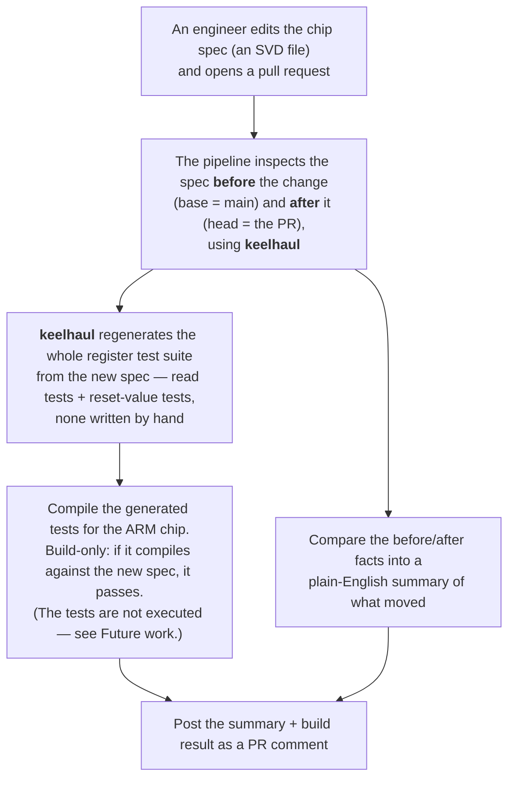

# Spec-Driven Register Verification Pipeline

When the hardware spec changes, the tests regenerate and check themselves —
automatically, on the pull request, with no register tests written by hand.

You edit a chip's register spec (an **SVD** file — see below) in a pull request.
A GitHub Actions pipeline regenerates the whole register test suite from the new
spec, proves it still compiles for the real ARM chip, and posts a plain-English
summary of what changed back on the PR.

Demo chip: the TI **TM4C123GH6PM** (ARM Cortex-M4F) — **781 registers**, **760**
with a checkable reset value, all derived from the spec, none typed by hand.

## What it does (at a glance)

- **A spec change drives everything.** Editing the SVD in a PR is the only
  trigger — no one has to remember to update tests.
- **No hand-written tests.** The register test suite is *generated* from the
  spec, so it can never fall out of sync with the spec.
- **It proves the tests still build.** The generated suite is cross-compiled for
  the real ARM target (`thumbv7em-none-eabihf`). A spec change that breaks the
  tests turns the PR check red.
- **Plain-English summary on the PR.** Exact counts of what changed — peripherals
  added/removed, registers moved, reset values edited — plus an optional
  AI-written narrative.
- **Correct with or without the AI.** Every number is computed in code; the AI
  only adds prose. The pipeline still passes and still reports when no AI token
  is configured.
- **Cheap by design.** The AI never sees the ~1.9 MB of raw spec — only a few KB
  of diff — so the cost per PR stays near zero no matter how big the chip is.
- **Chip-agnostic.** The whole pipeline is parameterized by a single SVD path.

## Background: what is an SVD?

**SVD** stands for **System View Description** — an XML file, in ARM's CMSIS-SVD
standard, that a chip vendor ships to describe a microcontroller's **register
map**: every peripheral, every register, its address, its bit-fields, its reset
value, and whether it's readable or writable. It's the machine-readable version
of the "registers" chapter of a datasheet. Tools use it to generate C headers,
drive debuggers, and — here — generate tests.

The related format **IP-XACT** (IEEE 1685) describes hardware for *chip design*
(IP blocks, buses, ports), where SVD describes a *finished chip* for firmware.
The generator used here reads SVD today, with IP-XACT support planned upstream —
so the pipeline only touches the spec at two stages, and would gain IP-XACT for
free if the generator ships it.

## The problem it solves

Memory-map specs change constantly: peripherals get added, register offsets
shift, reset values change. Every such change silently invalidates the
verification suite, and today someone finds out by hand — diffing XML, updating
tests, and triaging failures that might be spec bugs, implementation bugs, or
stale tests. Making the spec change itself the trigger means the suite is never
stale, and the reviewer gets a summary of exactly what moved.

## How it works



> **base vs head** are GitHub's two sides of a pull request: **base** is what you
> merge into (the old spec on `main`), **head** is your branch (the new spec).
> The pipeline compares the register map on both.

**The tests are generated and compiled, not run.** Proving that the regenerated
suite still builds against the changed spec is the pass criterion; executing it
on an emulator is future work.

Step by step:

1. **Trigger** — the workflow fires on any PR that touches `svd/**`. The SVD path
   is a workflow variable, so pointing it at a different chip is a one-line
   change.
2. **Introspect** — *introspection* just means running read-only commands that
   **inspect the spec and report facts about it** — how many peripherals, how
   many registers, how many have a known reset value — without changing
   anything. The pipeline does this on both the old and new spec.
3. **Generate** — [`keelhaul`](https://github.com/soc-hub-fi/keelhaul)
   regenerates the whole register test suite (read tests + reset-value tests)
   from the new spec.
4. **Compile gate** — the generated crate must build for the target triple
   (`thumbv7em-none-eabihf`). This *is* the pass criterion. Nothing is executed.
5. **Impact summary** — a two-layer summary: **facts** computed in code by
   comparing the introspection of old vs new (exact counts, added/removed
   peripherals, offset/reset-value edits), plus an optional **narrative** — an
   AI's prose reading of the diff, added when an AI token is configured.
6. **Report** — one PR comment with the summary, the introspection table, and the
   compiled/dropped test counts. Re-running edits the same comment instead of
   stacking new ones.

## Why the AI stays cheap

The two versions of the spec are about **1.9 MB of XML together** — very roughly
half a million tokens. Sending that to a language model on every PR would be slow
and expensive, and pointless: the model doesn't need the whole chip to describe a
change.

So the model is handed only the **`git diff`** (usually a handful of lines) plus
a **~0.3 KB introspection summary** — a few kilobytes total. And the exact
numbers in the report don't come from the model at all; they're computed in code.
The model only writes the prose. The result: the AI cost per PR stays near zero
regardless of how large the chip spec is, and every figure in the summary is
exact and reproducible whether or not the model runs.

## Design decisions

**GitHub Actions, not a hosted workflow engine.** The trigger (SVD changed in a
PR), the diff, and the reporting surface (PR comment) all live in GitHub. A
hosted engine would add a server and a webhook hop for no new capability; the
committed workflow YAML is itself the artifact.

**Tests are generated, never hand-written.** That is the whole idea — tests are
derived from the spec, so a spec change regenerates them for free. `keelhaul` is
installed from git and **pinned to a commit**, because its generated output feeds
the compile gate and an unpinned tool would make a green build unreproducible.

**Compile gate stays in the MVP.** AI-only impact analysis was considered and
rejected: the gate costs one CI step and is what makes the summary trustworthy —
the regenerated suite provably builds against the new spec.

**Execution (running the tests on emulated silicon) is deferred.** The MVP story
is complete at the compile gate, and emulator bring-up is the riskiest work — so
it is future work, not a blocker for a working, demoable pipeline.

## Built on keelhaul

The test generation is done by **[keelhaul](https://github.com/soc-hub-fi/keelhaul)**,
an open-source tool from SoC Hub that turns a CMSIS-SVD file into Rust register
tests. This project was inspired by keelhaul and wraps it in a
spec-change-driven CI pipeline: keelhaul does the generation, and this repo adds
the trigger, the compile gate, the diff-based impact summary, and the PR
reporting.

## Sharp edges found while building this

The generator's documented flags were not its actual flags. These were found by
building the tool and running it against the real SVD, and are all handled in the
pipeline:

- `--svd` requires `--arch` on **every** subcommand, not only generation.
- Flags are kebab-case (`--on-fail`, not `--on_fail`); `--test reset` requires
  `--test read`.
- `--on-fail error` generates code that does not compile (the error type uses
  `u32` where the test body casts to `u64`). The pipeline uses `--on-fail panic`;
  the `error` path is wanted for the execution phase and is blocked on an
  upstream fix.
- Vendor SVDs define the same address twice — the TM4C123 declares **43**
  alternate/overlaid registers (e.g. `USB0_TXINTERVAL7`, I2C `MCS`). The
  generator emits a duplicate function per definition, so the raw output fails to
  compile. [`scripts/fixup_generated.py`](scripts/fixup_generated.py) drops
  repeats **only when the bodies are byte-identical**, reports the count, and
  fails loudly if two definitions disagree about one address — that is a spec
  bug, not noise.

## Repository layout

```
.github/workflows/register-validation.yml   the pipeline
svd/TM4C123GH6PM.svd                         demo memory map (the SVD)
scripts/impact_summary.py                    deterministic facts + optional AI narrative
scripts/fixup_generated.py                   make the generated Rust compile
scripts/test_*.py                            unit checks (Python stdlib only, no framework)
testcrate/                                   no_std crate the generated suite lands in
```

## Running it locally

```sh
# install the generator (pinned to a known-good commit)
cargo install --git https://github.com/soc-hub-fi/keelhaul \
  --rev 9296b1878c64f656b67bd90a21bf186ddac513e0 keelhaul-cli
rustup target add thumbv7em-none-eabihf

# generate the tests, fix them up, and run the compile gate
keelhaul gen-regtest --svd svd/TM4C123GH6PM.svd --arch 32 \
  --test read --test reset --on-fail panic \
  | python3 scripts/fixup_generated.py > testcrate/src/lib.rs
cargo build --manifest-path testcrate/Cargo.toml --target thumbv7em-none-eabihf

# unit checks
python3 scripts/test_impact_summary.py
python3 scripts/test_fixup_generated.py
```

The summary's AI narrative runs only when an AI CLI is on `PATH`; without it, the
deterministic facts table is produced on its own. In CI the AI step runs only
when its token is configured as the `LLM_CLI_TOKEN` repository secret, so the
pipeline is green either way.

## Future work

The pipeline sees only `--svd <path>`, so each item below is a target parameter,
not a rewrite:

- **Execute the tests** on an emulated Cortex-M target (Renode or QEMU), reporting
  per-test pass/fail over a serial port and triaging failures (spec change vs.
  model gap vs. genuine mismatch). This needs the generator's `--on-fail error`
  path (see sharp edges) so the harness gets a result per test.
- **Negative tests** — auto-generated writes to read-only registers, reserved-bit
  writes, and unmapped-region accesses, gated by the same compile step.
- **Comment on fork PRs** — the build runs for any PR, but GitHub gives a PR from
  someone else's fork a read-only token, so posting the comment for an outside
  contributor needs the two-workflow `workflow_run` pattern.
- **IP-XACT input** — arrives for free if the generator ships it, since only the
  introspect/generate stages touch the spec.
